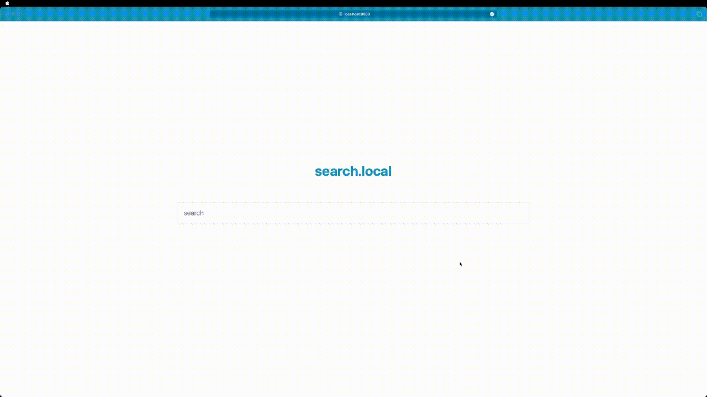

# search.local

**search.local** is a search engine running locally.



## Setup

To get this up and running you will need to:
- install the dependencies (FIXME: which ones)
- run `./setup.sh`
- run `./parse-blog-feeds.py`
- run `./index-blogs.py`

After the blogs have been indexed, you can proceed to running.

## Run it

```sh

./search.py # This takes a hot minute. When it's done, you can navigate to localhost:8080

```

## Goals

1. Give good results
2. Be able to run on slow hardware
6. Fun!
